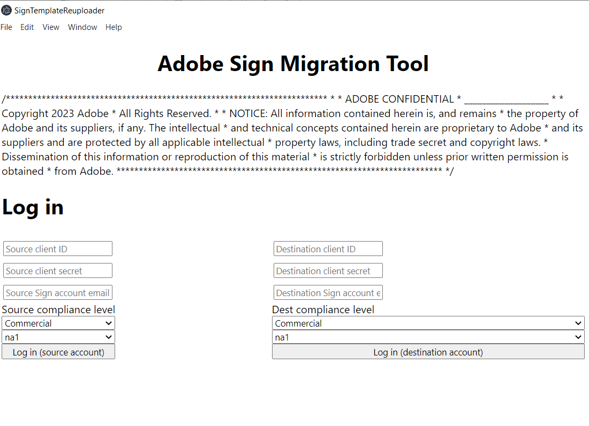
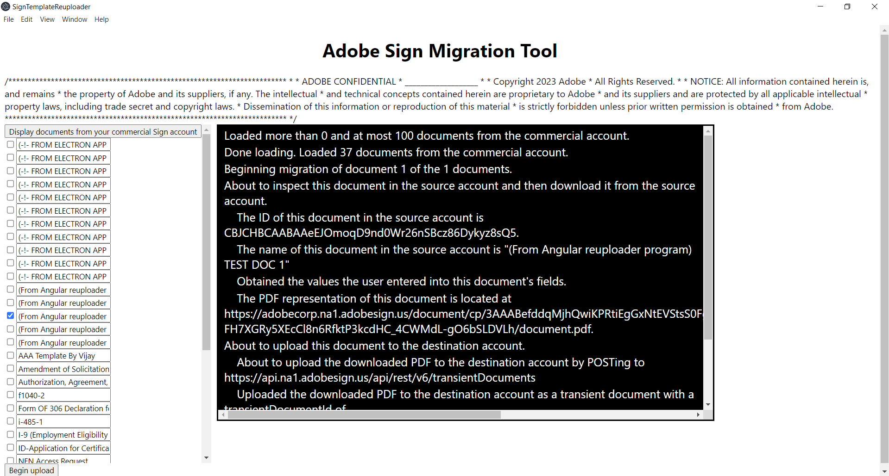

## Key Features

## Using Sign to Sign Template Migration Tool

The template migration tool is a standalone application, ran from your desktop. Simply log into the source environment and destination environment, choose which templates you want to migrate, then migrate!

## Installing Sign to Sign Template Migration Tool

The migration tool is an Angular app that just needs downloaded and built.

<a href="https://github.com/adobe/acrobat-sign-template-migration-tool">Click Here To Go To Repo</a>